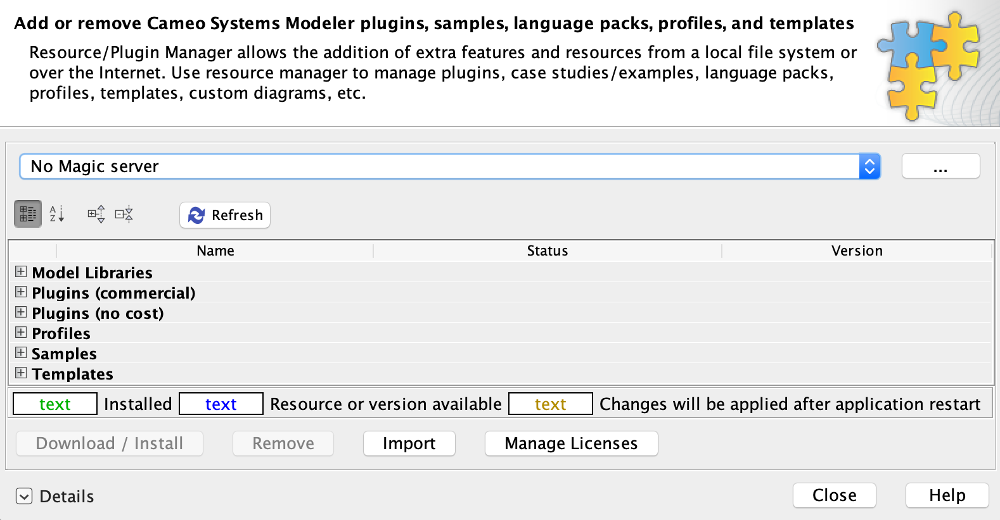

# Cameo Model Development Kit (MDK)

   

Cameo MDK is a plugin for [Cameo Systems Modeler](https://www.nomagic.com/products/cameo-systems-modeler) and other No Magic environment bundles that’s primary purposes are to sync models with the [MMS](https://github.com/Open-MBEE/mms-alfresco) and implement the [DocGen](src/main/dist/manual) language, which allows modelers to dynamically generate documents in a model-based approach using the view and viewpoint concept.

# Quickstart

## User Guide

The latest user documentation can be accessed online: https://mdk.readthedocs.io/en/latest

## Prerequisites

* [Cameo Systems Modeler (CSM)](https://www.nomagic.com/products/cameo-systems-modeler) or another No Magic environment bundle that includes the [SysML plugin](https://www.nomagic.com/product-addons/magicdraw-addons/sysml-plugin) (Only CSM has been tested)
    * The latest Cameo MDK is compatible with **2021x Refresh2** thru **2022x Refresh2**. Compatibility for previous versions of Cameo MDK can be found in the [compatibility matrices](https://github.com/Open-MBEE/open-mbee.github.io/wiki/Compatibilities).

* [Model Management System (MMS)](https://www.openmbee.org/projects.html#mms)
    * The Cameo MDK (5.0+) is compatible with MMS **4.x**. Compatibility for previous version of Cameo MDK can be found in the [compatibility matrices](https://github.com/Open-MBEE/open-mbee.github.io/wiki/Compatibilities).

## Installation

1. [Download](https://github.com/Open-MBEE/mdk/releases/latest) the Cameo MDK plugin, e.g. `mdk-*-plugin.zip`.

2. Run CSM. From the main menu, select "Help" > "Resource/Plugin Manager".
   
   
3. Click "Import", navigate to the downloaded Cameo MDK plugin, and click "Open".

4. CSM should confirm installation with the following prompt.

   
   
5. Restart CSM. To check installation, select from the main menu "Help" > "Resource/Plugin Manager" > "Plugins (no cost)" and ensure a row exists for "Model Development Kit" and its status is "Installed" with the correct version.
  
  
> Cameo MDK can also be installed headlessly by simply unzipping the plugin archive into the directory that CSM is installed in.
  

# Contributing

To learn how you can get involved in a variety of ways, please see [Contibuting to OpenMBEE](https://www.openmbee.org/contribute).

# Local Development

Cameo MDK is a Java project that uses the [Gradle](https://gradle.org/) build tool. It can be imported as a Gradle project in IDEs like [IntelliJ](https://www.jetbrains.com/idea/) and [Eclipse](https://www.eclipse.org/ide/).

## Custom Build Profiles
Starting with version 4.5.1+ you will be able to define custom build profiles (in `./buildProfiles`) which will house 
the classpath and other variables previously managed by setting `-buildAccess=internal`. These profiles will allow
customization based on your build process and for your particular version of Cameo. 

**NOTE:** By default build profiles are excluded from being committed to git by a `buildProfiles/.gitignore`

### Create a new profile
Create a new java properties file in `buildProfiles/<yourProfileName>.properties`.
In order to use a custom profile to run any of the below commands. Use the command with `-PbuildProfile=<yourProfileName>`
> For more examples of what properties are available in profiles see the example file in `buildProfiles/example.properties`

### For users of non-standard cameo bundles
To retrieve the classpath:
1. Copy the CLASSPATH entry from your `${md.install.dir}/bin/(magicraw/csm/cea).properties` file. 
2. Paste the entire line into a new file and find replace the `\:` with `,` and set it equal to `classpath`
3. Save this file to `buildProfiles/<yourProfileName>.properties`
> This is only necessary for custom build repositories or non-SP3 builds, most users will not need to modify the classpath
> and modification of the classpath is not necessary to use profiles!

## Build
>In order to use a custom profile to run any of the below commands. Use the command with `-PbuildProfile=<yourProfileName>` otherwise it will
>default to using `opensource`.

* `./gradlew dependencies` will download all necessary dependencies.
* `./gradlew assemble` will compile Cameo MDK from source.
* `./gradlew distZip` will package the installable plugin.
* `./gradlew installDist` will install the plugin in a staging environment.
* `./gradlew runJava` will interactively run CSM with Cameo MDK from the staging environment.

Task dependencies are declared such that all necessary prerequisites are executed/cached, e.g. `runJava` will first `dependencies`, `assemble`, `distZip`, etc.
