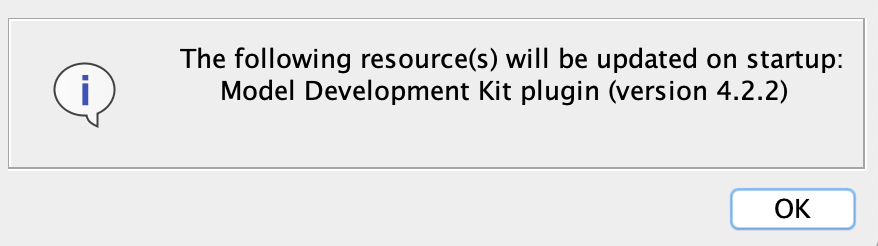

# Cameo Model Development Kit (MDK)

   

Cameo MDK is a plugin for [Cameo Systems Modeler](https://www.nomagic.com/products/cameo-systems-modeler) and other No Magic environment bundles that’s primary purposes are to sync models with the [MMS](https://github.com/Open-MBEE/mms-alfresco) and implement the [DocGen](src/main/dist/manual) language, which allows modelers to dynamically generate documents in a model-based approach using the view and viewpoint concept.

# Quickstart

## Prerequisites

* [Cameo Systems Modeler (CSM)](https://www.nomagic.com/products/cameo-systems-modeler) or another No Magic environment bundle that includes the [SysML plugin](https://www.nomagic.com/product-addons/magicdraw-addons/sysml-plugin)
    * The latest Cameo MDK is tested with and supports **19.0 SP3**. Compatibility for previous versions of Cameo MDK can be found in the [compatibility matrices](https://github.com/Open-MBEE/open-mbee.github.io/wiki/Compatibilities).
* [Model Management System (MMS) 3](https://github.com/Open-MBEE/mms-alfresco)

## Installation

1. [Download](https://bintray.com/openmbee/maven/mdk/_latestVersion) the Cameo MDK plugin, e.g. `mdk-*-plugin.zip`.

2. Run CSM. From the main menu, select "Help" > "Resource/Plugin Manager".
   
   
3. Click "Import", navigate to the downloaded Cameo MDK plugin, and click "Open".

4. CSM should confirm installation with the following prompt.

   
   
5. Restart CSM. To check installation, select from the main menu "Help" > "Resource/Plugin Manager" > "Plugins (no cost)" and ensure a row exists for "Model Development Kit" and its status is "Installed" with the correct version.
  
  
> Cameo MDK can also be installed headlessly by simply unzipping the plugin archive into the directory that CSM is installed in.
  
## Usage

Documentation can be accessed [online](src/main/dist/manual) or offline in CSM from the main menu "Help" > "Other Documentation" > "MDK [...] UserGuide".

# Local Development

Cameo MDK is a Java project that uses the [Gradle](https://gradle.org/) build tool. It can be imported as a Gradle project in IDEs like [IntelliJ](https://www.jetbrains.com/idea/) and [Eclipse](https://www.eclipse.org/ide/).

## Common Tasks
* `./gradlew dependencies` will download all necessary dependencies.
* `./gradlew assemble` will compile Cameo MDK from source.
* `./gradlew distZip` will package the installable plugin.
* `./gradlew installDist` will install the plugin in a staging environment.
* `./gradlew runJava` will interactively run CSM with Cameo MDK from the staging environment.

Task dependencies are declared such that all necessary prerequisites are executed/cached, e.g. `runJava` will first `dependencies`, `assemble`, `distZip`, etc.
