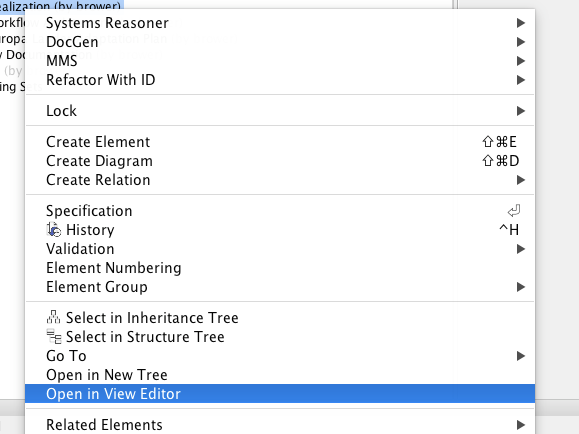

*************
Key Concepts
*************
The following views are designed to guide the user through using all aspects of the MDK.

Logging in to MMS
=================

Because many MDK features expect that you are logged in to the MMS, you may be prompted to login to the MMS when a MDK- enabled project is loaded. This login prompt occurs near the end of the load cycle, but will not block MagicDraw from completing the model load. If the login fails or is cancelled, MDK will revert to offline mode. Any changes will be persisted in the model, and you will be unable to receive changes from or send changes to MMS until you successfully log in. Other offline features of MDK are unaffected. You may login at any time by selecting "Login" from the "MMS" menu and submitting your credentials through the dialog box.
If you commit a MDK-enabled project to Teamwork Cloud (TWC) but are not logged in to MMS, you will be prompted to log in the MMS. This prompt occurs immediately after you submit the commit message, and will block MagicDraw from completing the commit to TWC until it is submitted or cancelled. If this login fails or is cancelled, you will continue to not have access to the online functionality as described above.

MMS Menu
=========

The following provides an overview of the different operations that are offered through the top MMS menu. For information about the MMS menu that appears when selecting an element, such as a document, refer to Section .

- Login - Trigger a prompt for credentials to be used to log in to the MMS. When logged in, the options that require MMS interaction will be enabled.
- Logout - Clear your MMS authentication. It will also disable any options that require a connection to the MMS.
- Generate All Views - Generates all Views in the project. It is functionally equivalent to finding all Views, right clicking, and selecting "MMS" > "Generate View Contents".
- Validate - Validate elements or project attributes in bulk, such as Views and branches.

MMS Syncing
============

Syncing with MMS is an automated process that is typically transparent to the user. These views explain how this occurs, cases where manual intervention is required i.e. conflicts, and how to recover from a loss of parity.

Coordinated Syncing
--------------------

Coordinated Sync ties the MMS synchronization functionality to MagicDraw's Teamwork Cloud (TWC) commit action. When a TWC commit is initiated in MagicDraw, coordinated sync triggers a similar commit to the MMS. 
This minimizes the user interactions required to keep the model up to date on the MMS and ensures that parity is maintained between the TWC model and the MMS model. This also vastly reduces the need for alternative sync methods such as `Manual Syncing`_.

Description
^^^^^^^^^^^^

While you are editing the model, element changes are collected in memory to be processed on your next save / commit. This includes direct changes to your model, such as new elements or updated documentation, as well as reference changes that can arise from changes to mounted projects. MMS changes by other users, in MagicDraw or View Editor, are also stored in memory to be processed during the sync operation (these changes are not stored in memory if you are not logged in to the MMS).
When a TWC commit is initiated and a coordinated sync occurs, these two change lists are processed. MMS element changes are updated into the MagicDraw model as possible. After this model update, MagicDraw model changes are committed to the MMS in the background of the TWC commit. Finally, the model save/commit occurs.
Any conflicts caused by changes to elements in both MagicDraw and MMS introduced by any user on either end will be stored in the model for any user to resolve as desired. They will also be presented to the user in the validation window upon save/commit.

These conflicts will be presented to the user on every save/commit until resolved. The presence of conflicts does not prevent completion of the TWC commit operation.

Usage
^^^^^^

- On Model Open
    - Coordinated Sync will prompt the user to log in to MMS. Logging in allows it to listen to messages track changes in real time, and be ready to gather and apply them at the appropriate time.
        - Cancelling this login, or submitting invalid credentials, will not prevent you from working on the model. It will only prevent you from receiving messages about elements changed in the MMS and prevent you from committing to the MMS until after you log in manually. Changes made to the model will be persisted locally for later commit.
- On Model Save / TWC Commit
    - Coordinated Sync will automatically perform model synchronization with MMS, committing MagicDraw elements to MMS or deleting elements no longer present in MagicDraw.
    - Coordinated Sync will update elements in MagicDraw based on MMS changes if the element can be edited and there is no version conflict between the MagicDraw and MMS versions of the elements.
        - Elements with pending updates will be presented to the user as a validation violation so that the user can plan to lock them before next commit, if desired. These will be stored in a list in the model for future checking.
    - Coordinated Sync will not update elements in MagicDraw of MMS that have pending changes on both the MagicDraw and MMS side, as it cannot determine which version of the element is correct.
        - Elements with these conflicts will be presented to the user as a validation violation for manual resolution. These will be stored in a list in the model for future checking.
    - Coordinated Sync will also validate all elements in its list of elements whose updates failed due to locks or conflicts, according to the above rules. If an update can be performed, the element will be updated in MagicDraw and removed from the list. Similarly, if the element is equivalent between MagicDraw and MMS, the element will be removed from the list. Any elements that remain out of sync with MMS will be again displayed as a validation violation.

Manual Syncing
----------------

Manual validation is intended to only be used to re-establish parity if it is lost, i.e. by application error, MagicDraw project reversion, etc., but models should generally be synced using Coordinated Syncing. If you have to manually validate, it is best to follow the CRUD rules about order of operations: 1) create 2) update 3) delete.

Manual validation options can be found by right clicking any element and selecting the "MMS" category. The three options are as follows:

- Validate Models: Run validation on the element(s) selected and all those contained by them.
- Validate Models (specified depth): Run validation on the element(s) selected and elements that are contained by them to the specified depth.
- Validate Element: Run validation on the element(s) selected.

Resolving Conflicts and Errors
--------------------------------

During any of the MMS synchronization operations, the MDK checks for conflicts between the MMS and the MagicDraw model. These conflicts may indicate a difference between what is in the current project model and an edit in View Editor, or they may be caused by data being updated on the MMS by a different application.
Conflicts will appear either in a Validation window, and each one may be interacted with via the context (right-click) menu in order to commit the MagicDraw version or updated from the MMS version. Additional information about the conflict may be available in the context menu as well. Error messages will appear on the Notification window, and may not be interacted with.

Branch Syncing
----------------

Both TWC and MMS support branching as a part of their version control functionality. MDK syncs branches created in TWC by committing them to MMS. To validate the branches on both sides, select "MMS" from the main menu > "Validate" > "Branches". Validation rule violations will be presented if they are not in sync, and resolutions can be selected by right clicking each violation.

.. note:: 
    
    This applies to Teamwork Cloud (TWC) projects, but not local projects as the latter do not have branching.

Feature Guide
======================

The following views are designed to provide users with information about key MDK features, including explanations of their use and how they affect a modeler on a daily basis.

Documents and Views
--------------------

Documents and Views can be created and modeled in MagicDraw and generated to View Editor.

Documents are a key part of systems engineering; through the practice of Model Based System Engineering (MBSE), documents have also been adapted so that they are able to be generated and produced from a model. Documents consist of Views, which are sections of a document. Both Documents and Views are based on Classes in UML and therefore are treated as elements in the model, with their own associated attributes and formatting metadata.

    Implications:
    
    A SysML model is not required to produce a document; however, the main interface between MagicDraw and View Editor, the web application, is primarily done through the interactive capabilities of documents and views. They are used to provide access to modeling data outside of the model itself.
    Documents and views are built and configured using Section 2.4.2. More information can be found in the next view. `Open in View Editor`_

Open in View Editor
^^^^^^^^^^^^^^^^^^^^

You may wish to inspect a view after generating it with the MDK, to confirm that it matches your expectations. The "Open in View Editor" feature allows you to easily open a Document of View on View Editor from its element representation in MagicDraw.
To use this feature, right-click the element in a diagram, containment, or similar view and select "Open in View Editor" from the context menu. This feature will build a full web link to the selected View by navigating up the view hierarchy to find the Document that contains the View, and then simply open the web link in your default browser.
If a Document or View is a child of multiple Documents, the feature will instead build a link for each Document and open a new window with a button for each Document. Clicking on one of the Documents listed will open the appropriate web link.
If a View is not a child of any Documents, the feature will display a message in the Notification Window of MagicDraw and open the View in View Editor without a Document context.
Use of this feature does not require you to be logged in to MMS, but does require that your model have a MMS server specified in its ModelManagementSystem stereotype.

.. warning:: 
    This feature requires model configuration using the `Model` documentation as described in :ref:`initialization:Configuration via JSON (New 5.1.0+)`

.. note:: 
    In the event that Java fails in its attempt to open a link in your default browser, a message will appear in the Notification Window of MagicDraw that includes the web address. This can by copied into your web browser to open the page manually.

    Open In View Editor

Viewpoints and Viewpoint Methods
--------------------------------

One of the defining moments for widespread adoption of SysML at JPL was when the community created "DocGen" (see DocGen), a precursor of the MDK plug-in, which gives MBSE practitioners the ability to produce documents from their models. In order to create these documents, the view and viewpoint method was introduced.
A pattern is a set of rules governing model construction that provide standardization and consistency across models. The method for document creation is one such pattern adopted by the Object Management Group (OMG, the standards body behind SysML) and was incorporated
into SysML 1.4.
Viewpoints and Viewpoint Methods can be created in MagicDraw and will result in View Editor. Refer to Section 2.5.1 and Create a Reusable Cover Page for examples of using Documents, Views, Viewpoints, Viewpoint Methods, and Exposing elements.

Viewpoints:

- Can be thought of as the "compiler" for a view.
- Dictate what will actually be displayed in a view.
- Uses the viewpoint methods and the exposed elements to produce a view.

Viewpoint Methods:

- Are a set of rules that govern model construction to give standardization and consistency across models.
- Can be thought of as the "constructor".
- Consist of activity flows that are specialized to be in charge of building what the view will be.
- The most common viewpoint method are those that make Tables - they take the exposed elements and iteratively go through them to produce the desired table. More information on how to build such a table can be found here: Section 2.5.1.3. 13

Implications:

Using the model, a user will consistently utilize Viewpoints and Viewpoint Methods to construct documents and views. These documents and views may contain any number of important modeling information, based on what the user desires. The user will then generate these formatted and configured documents and views so that users on View Editor can have access to the model information and data.

.. note::
    If the viewpoint method diagram is created by methods other than right clicking the viewpoint itself on the view diagram (such as right clicking the viewpoint in the containment tree), an error may occur during document generation regarding a viewpoint method. This error may be resolved by right clicking the error in the notification window > Set Nested Behavior as Viewpoint Method.

    There are two ways to check for this error before view generation:
    
    - Right click a View > DocGen > Validate View
        - Any not compliant views will appear in the notification window. Right click error > Set Nested Behavior as Viewpoint Method
    - Select "MDK" from the top ribbon > Validate > Views
        - Any not compliant views will appear in the notification window. Right click error > Set Nested Behavior as Viewpoint Method

\_MMSSync\_ Package
--------------------

The \_MMSSync\_ package is part of a number of sync solutions for the MMS and View Editor. Its purpose is to allow continual collaboration while a project is consistently being updated by multiple users. It does this by capturing changes between the model and the MMS server and persisting them in the model. The idea is that when an element is updated from the server, whoever is using the syncing options will capture the changes and the MDK will try to update the model itself. However, if there is some non-editable content or errors of any sort that would prevent the MDK from automatically updating, these changes will be saved in the \_MMSSync\_ package. Once stored, the changes will be tried to be resolved/updated the next time it is run.
Although the \_MMSSync\_ package looks like an ordinary Package, users must NOT edit the content. A user may try to unlock the elements in Teamwork Cloud projects, but should not edit the elements themselves. If the user manually modifies this Package or its contents, parity and/or data could be lost.

Usage:

- Every project that is connected to MMS will have an \_MMSSync\_ package.
- References to all changed (categorized as created, updated, and deleted) elements on both MagicDraw and MMS will be persisted in elements in this package.
- These changed elements will be analyzed during sync operations to generate the necessary operations to sync the model.
- Each element in this package will be categorized and timestamped.
- Each element in this package is automatically managed and deleted by the MDK. No user intervention is required or recommended. See version specific implications for more information.
- In the case that elements in this package cannot be deleted due to insufficient locks, a second element is created that signifies to sync operations that the first one can be safely ignored as its contents have already been processed.

Holding Bin Package
--------------------

The "Holding Bin" Package is created for every project. Its purpose is to provide a default place to put elements that were created without an owner specified. This is often the case for Documents and Views that originated in View Editor. Elements in the Holding Bin can be moved to other locations in the project just like other model elements.

.. autosummary::
   :toctree: generated