**************
User's Guide
**************

The following views are dedicated to guiding users through some of the most commonly used workflows that involve MDK.

Create and Generate Documents
==============================

The following views focus on foundational training to get any user to be able to interact with the MMS and subsequently View Editor. The goal at the end of these views is for the MDK user to be able to Section 2.5.1.1 , Section 2.5.1.1.1.1 , and Section .

Creating Documents and View's
------------------------------

In these instructions, the user creates a new (blank) document in MagicDraw using MDK's tools for Documents and
Views. Committing these new elements is required for proceeding to the next step, Section 2.5.1.1.1, where the user will generate the document so it appears on View Editor.

Setup: 
    Model has been synced to MMS (See :ref:`initialization:Sync Project with MMS` for more information on this process) A new package is created for the purpose of simple organization. Each modeler should follow the modeling practices of his/her project.

1. Create a View Diagram
    - Right click the package in the containment tree where you would like to create the view diagram > create diagram > select "view diagram" from the MDK section of the diagram list
    - New diagram is created and is displayed in the middle pane

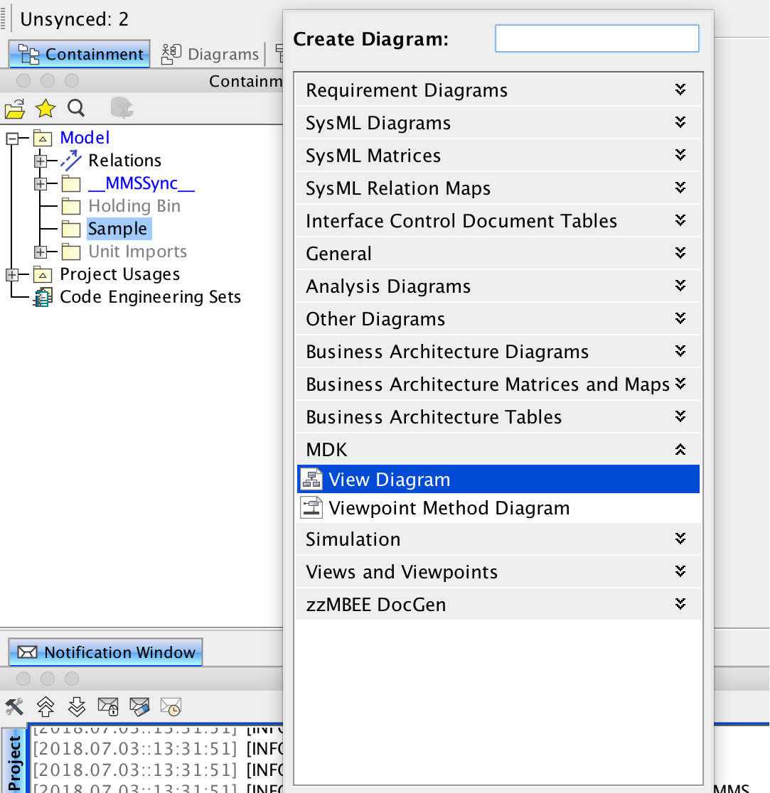

    Menu when creating a new View Diagram

2. Create new Document
    - Select "Document" from the menu to the bottom left of the diagram in the center pane
    - Click anywhere in the empty diagram to add the document
    - Double click on the newly created document or right click > specification to open the document specification
    - Enter a name in the name section of the specification

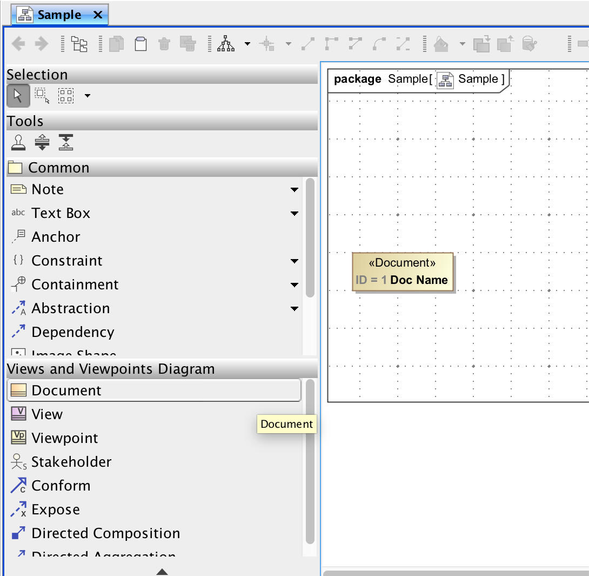

    View Diagram when creating a new document

3. Create a View
    - Select "View" from the menu to the bottom left of the diagram in the center pane
    - Click anywhere in the empty diagram to add the view
    - Double click the newly created document or right click > specification to open the view specification ◦ Enter a name in the name section of the specification

4. Create a "Directed Composition" relation from the new Document to the new View
    - Select "Directed Composition" from the menu on the bottom left of the diagram in the center pane
    - Click on the document, then click on the view to create a directed composition relationship between them
    - Relationship should appear between the two elements with a black diamond on the end of the document and an arrow on the end of the view

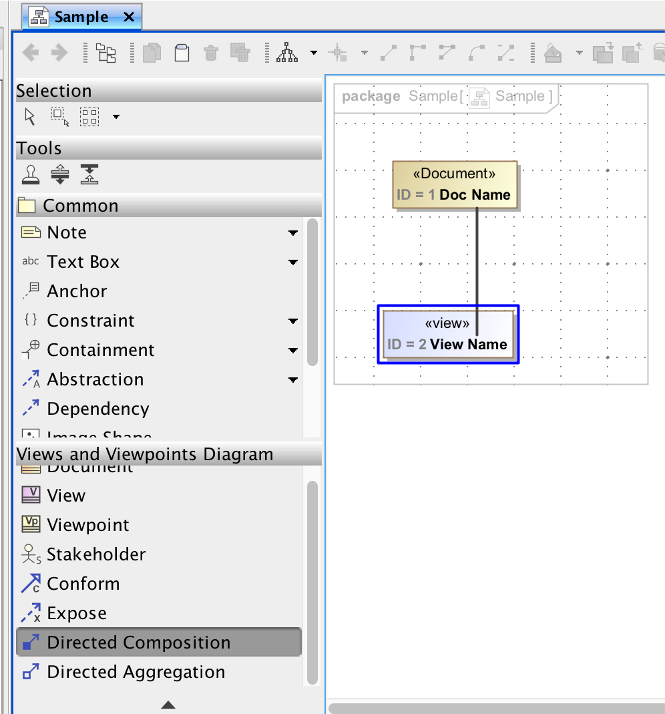

    Creating a directed composition relationship to a new view.

Generate Views and Sync with MMS
---------------------------------

Generate select documents:

1. Generate Views by right clicking the document (in diagram or containment tree) > MMS > "Generate View Contents" or "Generate View Contents Recursively".
2. Results of generation appear in a message in the notification window
3. Navigate to document on view editor
4. Updated Document and views should be visible
5. Save changes in MagicDraw

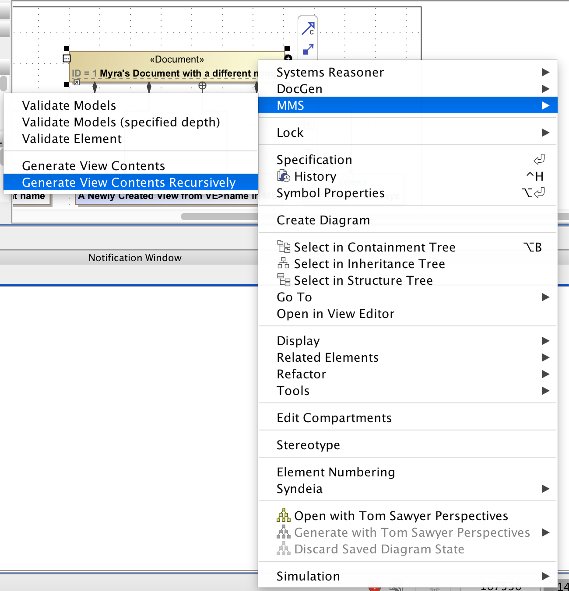

    Usage of right-click menu for generating views from a document or view object.

Generate all documents in a model:

1. Select "MMS" from the top ribbon >> Generate all Views
2. Results of generation appear in a message in the notification window
3. Navigate to the project on View Editor
4. Updated documents and views should be visible
5. Save changes in MagicDraw

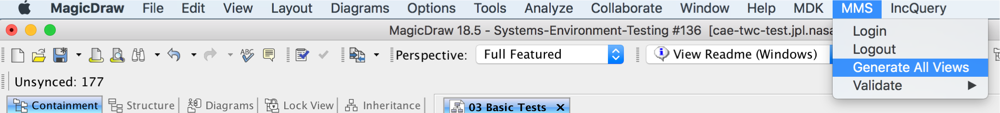

    Usage of top MMS menu to generate all views in a model.

Creating a Viewpoint and Viewpoint Method
-------------------------------------------

The following instructions show one of the most basic ways of using viewpoints and viewpoint methods to construct contents of a view. 
For more information about what viewpoints and viewpoint method are, refer to :ref:`functions:viewpoints and viewpoint methods` . 
More detailed information about creating specific viewpoints and methods can be found in the :ref:`docgen:docgen users guide`.

1. Create a new View as described in :ref:`guide:Generate Views and Sync with MMS`
2. Create new View Point by selecting "Viewpoint" from the menu to the lower left of the view diagram and clicking on open space in the diagram. Name the View Point.
3. Create a "Conforms" relation from the new View to the new View Point.
    - Select "Conform" relationship from the menu to the lower left of the view diagram.
    - Click the view, then the view point
    - Conform relationship is displayed as a white arrow pointing to the view point.
4. Select a diagram from the containment tree (to insert as an image) and drag it into the view diagram
5. Create an "Expose" relation from the chosen view to the diagram
    - Select "Expose" relationship from the menu to the lower left of the view diagram
    - Click the view, then the diagram
    - Expose relationship is displayed as a dotted line pointing towards the diagram

    .. figure:: ./images/create-expose-relationship.png

        View Diagram after adding conforms and expose relationships.

6. Right click the "operations" section of the Viewpoint > Create Method > Diagram > "Viewpoint Method Diagram" under the MDK section

.. _method-figure:

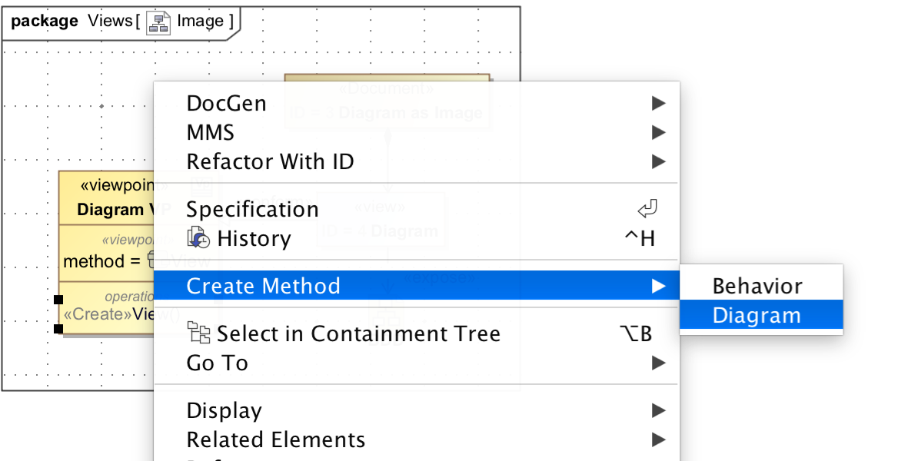

    Usage of right-click menu to add a Viewpoint Method.

.. note:: 
    If the viewpoint method diagram is created by other methods (such as right clicking the viewpoint in the containment tree), an error may occur during document generation regarding a viewpoint method. This error may be resolved by right clicking the error in the notification window > Set Nested Behavior as Viewpoint Method. There are two ways to check for this error before view generation:
        
    - Right click a View > DocGen > Validate View
        - Any not compliant views will appear in the notification window. Right click error > Set Nested Behavior as Viewpoint Method
    - Select "MDK" from the top ribbon > Validate > Views
        - Any not compliant views will appear in the notification window. Right click error > Set Nested Behavior as Viewpoint Method

Insert Diagram as Image
------------------------

1. Create a new View in the Document for the table as described in :ref:`guide:Creating Documents and View's`
2. Create new Viewpoint and Viewpoint Method as described in :ref:`guide:creating a viewpoint and viewpoint method`
    - Name new Viewpoint
    - Connect Viewpoint to new View via "Conforms" relationship

3. Start creating the method activity on the viewpoint method diagram
    - Insert "Initial Node" (from menu to left of diagram, under the Common section)
    - Insert ”Image" (from menu to left of diagram, under the Templates section)
    - Insert “Activity Final" (from menu to left of diagram, under the Common section)
    - Connect activity flow by clicking the element, selecting "Control Flow" from the popup menu (icon is an arrow), and clicking of the subsequent element

.. figure:: ./images/image-viewpoint.png

    Activity diagram showing a Viewpoint Method that will export the image of an exposed diagram to View Editor

4. Commit Changes
    - From the View Diagram, right click on the document > MMS > “Generate Views Contents Recursively"
5.  Diagram should now be visible on View Editor

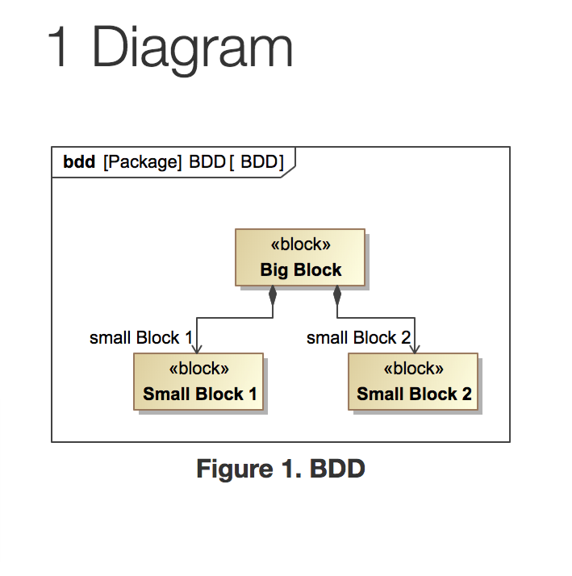

    Shows what a diagram exported to View Editor might look like.

Create and Generate a Table
-----------------------------

For more information about what viewpoints and viewpoint method are, refer to :ref:`functions:viewpoints and viewpoint methods` . 
More detailed information about creating specific viewpoints and methods can be found in the :ref:`docgen:docgen users guide`.

1. Create a new View in the Document for the table as described in :ref:`guide:Creating Documents and View's`
2. Create new Viewpoint and Viewpoint Method as described in :ref:`guide:creating a viewpoint and viewpoint method`
    - Name new Viewpoint
    - Connect Viewpoint to new View via "Conforms" relationship

3. Drag existing package of blocks onto diagram
    - Connect package and view via "Expose" relationship 4. Create View Point Method Diagram
    - Right click the "operations" section of the Viewpoint > Create Method > Diagram > "Viewpoint Method Diagram" under the MDK section (see :numref:`Fig. %s <method-figure>`)

    .. note::

        If the viewpoint method diagram is created by other methods (such as right clicking the viewpoint in the containment tree), an error may occur during document generation regarding a viewpoint method. This error may be resolved by right clicking the error in the notification window > Set Nested Behavior as Viewpoint Method

4. Start building the activity - the end result will create a table that has the name of the blocks.
    - Create “Initial Node” from left menu
    - Create “CollectOwnedElements” from left menu
    - Create “FilterByStereotypes” from left menu
        - Double click FilterByStereotypes or right click > specification
        - Find “Stereotypes” under StereotypesChoosable > search for "Block" and select Block[Class] Sysml::Blocks
    - Create “Table Structure” from left menu
        - Name the table. This name will display in the view
        - Create “Initial Node” inside the table.
        - Create “TableAttributeColumn” inside the table.
            - Name the column. This name will display in the view
            - Double click TableAttributeColumn or right click > specification
            - Find “Desired Attribute” > select desired attribute from options (ex. name)
            - Create “Activity Final” inside the table.
        - Create “Activity Final” outside the table, in the activity.
        - Connect all control flows

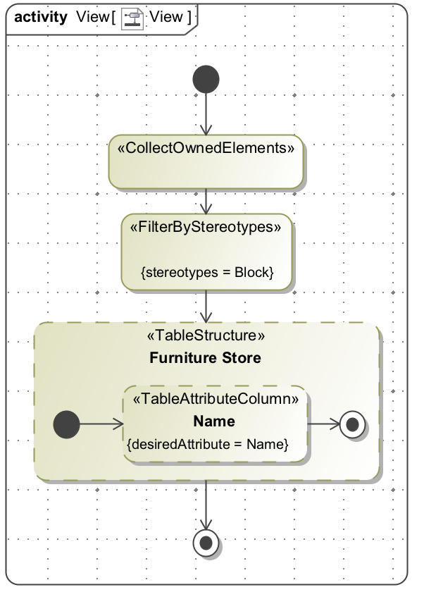

    Viewpoint Method Activity for generating a simple table.

5. From the View Diagram, right click document > MMS > “Generate View Contents Recursively"
6. Table should be visible in view editor

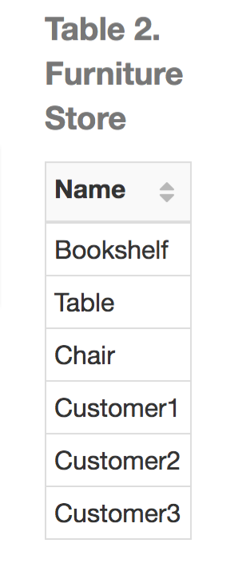

    Example of a table that was created in a Viewpoint and exported to View Editor

.. note:: 
    
    Tables with additional columns may be created by adding more TableAttributeColumn elements into the Table Structure.

Generate Views Locally
-----------------------

A user can generate Views locally as DocBook XML by right clicking a View > "DocGen" > "Generate Document". 

The resulting DocBook XML can then be converted to other file formats, such as PDF, Word document, etc., with third-party tools. 

An example of such a tool is Oxygen XML Editor.

Create a Group of Documents
============================

Groups offer users the ability to better organize projects by allowing Packages to be designated as containers of Documents. Tools that visualize Documents, such as View Editor, would display these Groups in navigation. Documents that are owned by the Group (recursively) would show up under that Group. This is for organizational purposes and applies no semantics.

1. Double click a Package that will represent a group or Right click > Specification
2. Click "Stereotype" in the context menu.
3. Add "Group" stereotype in the popup menu and click "Apply".
4. Commit Changes

Create Enumerated Values
============================

One of the more sophisticated features of View Editor is the option to have values be enumerated values. This means that a user will only be allowed to set an element's value to a specific set of choices. In View Editor, this is shown as a drop down list. This can be extremely useful for elements that are similar in makeup but have different properties and different values.The following instructions demonstrate how to create enumerated values so that they may be seen as drop down lists on View Editor.

**Creating the Enumeration:**

1. Create an "Enumeration" element
    - Right click on a package that will contain the enumeration > create element > enumeration
    - Name the enumeration

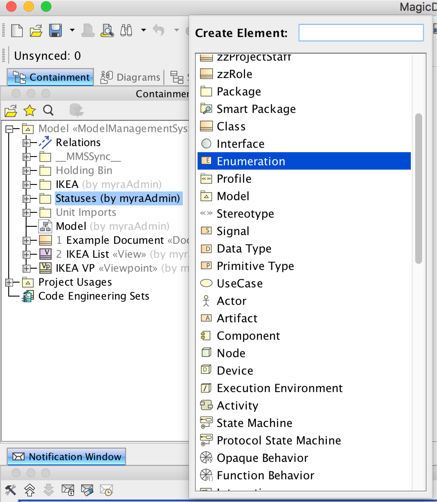

    Example of creating an enumeration inside Cameo.

2. Create enumeration literals. Enumeration literals represent the values that the enumeration may hold
    - Right click on the newly created enumeration > create element > enumeration literal
    - Name the enumeration literal
    - Create multiple enumeration literals for each enumeration

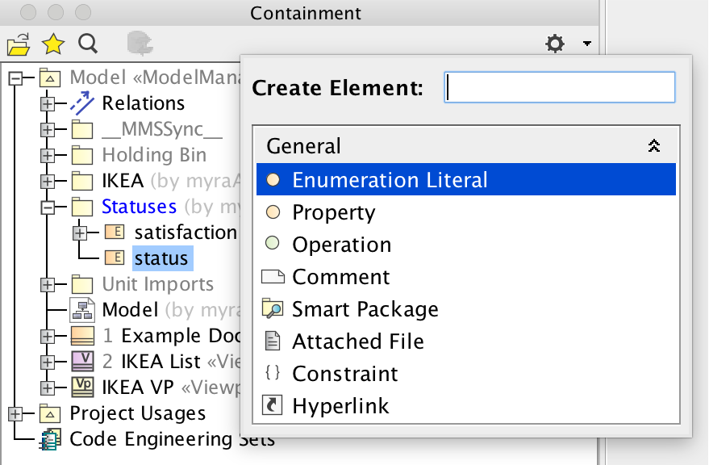

    Menu showing how to create Enumeration Literals.

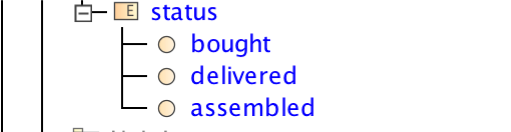

    Containment tree after adding Enumeration Literals

**Create a Property Typed by Enumeration:**

1. For each component that will utilize the enumeration, create a part property 
    - Right click component > create element > Part Property
    
    .. note:: (Optional) Once the part property has been typed by the enumeration, the part may be refactored as a value property and maintains the same functionality
    
    - Name the value property (preferably the name of the enumeration)

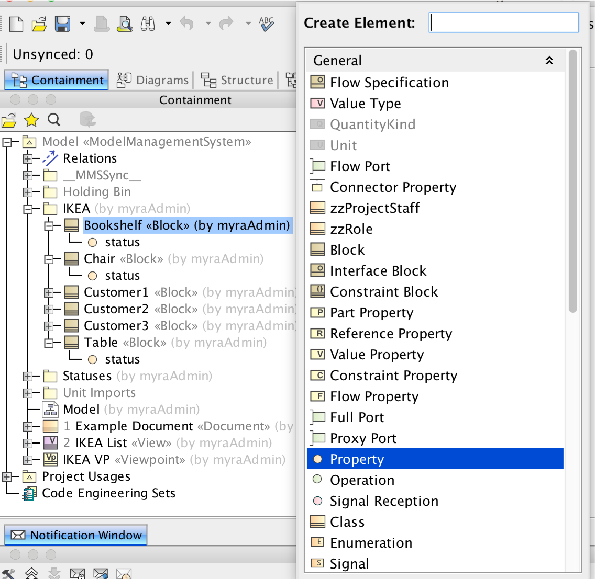

    Open create element menu showing how to create a part property

2. Open the specification of the value property by double clicking or right click > specification
    - Select the "default value" field > select the arrow to the right of the field > value specification > delete expression

.. figure:: ./images/set-default-value.png

    Shows clicking the default value and removing the expression

3. Set the "Type" of the value property as the enumeration
    - Open the specification of the value property by either double clicking or right click > specification
    - Drag the enumeration from the containment tree to the "Type" field in the specification or browse for the enumeration

4. Under specification, default value may now be specified as any of the enumeration literals

**Using Enumerations in a Viewpoint Table**

The following instructions demonstrate how to create enumerated values so that they may be seen as drop down lists in the column of a Table (Section 2.5.1.3) on View Editor

1. Create a new View in the Document for the table as described in :ref:`guide:Creating Documents and View's`
2. Create new Viewpoint and Viewpoint Method as described in :ref:`guide:creating a viewpoint and viewpoint method`
    - Name new Viewpoint
    - Connect Viewpoint to new View via "Conforms" relationship

3. In the viewpoint method diagram, include the following elements:
    - Initial node
    - CollectOwnedElements
    - FilterByStereotypes with stereotypes field set to the element type containing properties with enumerations (ex. block)
    - Table Structure
    - Activity Final node
  
4. Within the Table structure, include the following elements:
    - Initial node
    - TableAttributeColumn with desired attribute (ex. name)
    - TableAttributeColumn with desired attribute set to "value"
    - Activity Final node
5. Within the TableAttributeColumn with the attribute set to "value", include the following elements:
    - Initial node
    - CollectOwnedElements
    - FilterByNames with the NameChoosable field set to the name of the part property with enumerated values
    - Activity Final node
6. Define control flow between all elements on the diagram.

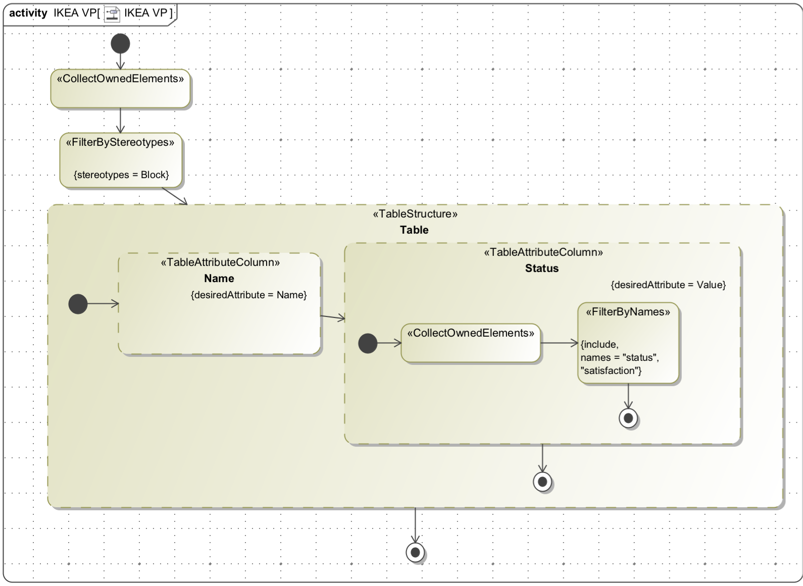

    Example Viewpoint Method that will generate a table with an enumeration value.

7. Save changes
8. Generate document
    - Right click document > MMS > Generate View Contents Recursively
9. See that table is generated in View Editor that includes the name of the element and its value (one of the enumeration literals). When the value is edited, the list of enumeration literals is displayed as a dropdown menu.

Create Togglable Boolean Values
================================

Another relevant feature of View Editor is the option to have an element's value be Boolean. In View Editor, this is shown as a toggable check box indicating if a value is "True" or "False". This can be extremely useful for all elements that require a quick Boolean answer.
These instructions demonstrate how to create togglable Boolean values so that they may be seen as check boxes on View Editor. This example builds off of Section 2.5.1.3 for the first table column and Section 2.5.3 for the second table column.

**Create Togglable Boolean:**

1. For each component that will utilize a togglable boolean, create a value property
    - Right click component > create element > value property
    - Name the value property
2. Set the default value of the value property to literal boolean
    - Double click the value property or right click > specification
    - In the default value field, select the arrow to the right of the field box > value specification > literal boolean
    - The default value is now a togglable true/false

**Using Enumerations in a Viewpoint Table**

The following instructions demonstrate how to create boolean values in a table so that they may toggled on or off in the column of a Table (Section 2.5.1.3) on View Editor

1. Create a new View in the Document for the table as described in :ref:`guide:Creating Documents and View's`
2. Create new Viewpoint and Viewpoint Method as described in :ref:`guide:creating a viewpoint and viewpoint method`
    - Name new Viewpoint
    - Connect Viewpoint to new View via "Conforms" relationship

3. In the viewpoint method diagram, include the following elements:
    - Initial node
    - CollectOwnedElements
    - FilterByStereotypes with stereotypes field set to the element type containing properties with enumerations (ex. block)
    - Table Structure
    - Activity Final node
  
4. Within the Table structure, include the following elements:
    - Initial node
    - TableAttributeColumn with desired attribute (ex. name)
    - TableAttributeColumn with desired attribute set to "value"
    - Activity Final node
5. Within the TableAttributeColumn with the attribute set to "value", include the following elements:
    - Initial node
    - CollectOwnedElements
    - FilterByNames with the NameChoosable field set to the name of the part property with enumerated values
    - Activity Final node
6. Define control flow between all elements on the diagram.

    Example Viewpoint Method that will generate a table with an enumeration value.

7. Save changes
8. Generate document
    - Right click document > MMS > Generate View Contents Recursively
9. See that table is generated in View Editor that includes the name of the element and its value (one of the enumeration literals). When the value is edited, the list of enumeration literals is displayed as a dropdown menu.

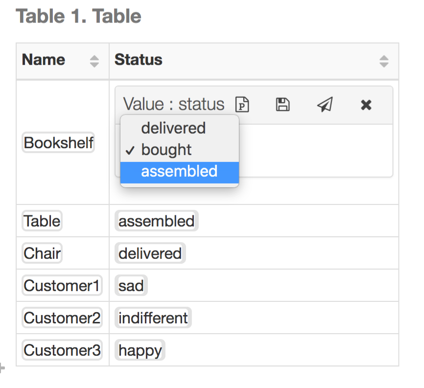

    Resulting table showing the dropdown menu when editing table values in View Editor.

Create a Reusable Cover Page
================================

A user can create a reusable cover page by constructing a ViewPoint with a ViewPoint method. Once the method is made, a user can apply it to any View, and specifically to the Cover Page of a document. See Section 2.4.2 for more information about using them in general and see DocGen for more detailed information.
This model based cover page will be reflected when generating PDFs as well. See Save As for more information on saving a document (with said cover page) in different forms, including generating a PDF.

The following instructions is an overview about how to create a simple, reusable Cover Page for a document that already exists:

1. Find a Document that already exists (Concise Demo Document )
2. Open the document's View Diagram by double clicking
    - If it has/belongs to a View Diagram, double click the Diagram and view in main window
        - To find the View Diagram, Right Click the Document>>Go To>> Usage in Diagrams ....select the appropriate View Diagram
    - If it does not have a View Diagram,
        - Right click the containing package>>Create Diagram>>MDK>>View Diagram
        - Name the View Diagram
        - New Diagram should be shown in main window
        - Drag the Document onto the View Diagram
3. Set Up Document Cover Page relationships

.. note:: 
    Although these instructions are specifically in regards to generating a Document Cover Page, the ViewPoint can be applied to any View and would appear the same.

    - Create a new Viewpoint
        - While on the View Diagram, drag and drop the "Viewpoint" icon from the tools pane onto the Diagram
        - Name the new Viewpoint ("Concise Demo Cover Page")
        - Connect the Document to the new Viewpoint via a "Conforms" relationship
    - Drag wanted elements that will be used for constructing the Cover Page
        - Connect Document to said elements via "Expose" relationship
4. Create View Point Method Diagram
    - Right click the "operations" section of the Viewpoint > Create Method > Diagram > "Viewpoint Method Diagram" under the MDK section

.. note:: 
    If the viewpoint method diagram is created by other methods (such as right clicking the viewpoint in the containment tree), an error may occur during document generation regarding a viewpoint method. This error may be resolved by right clicking the error in the notification window > Set Nested Behavior as Viewpoint Method

5. Create ViewPoint Method Activity
    - The following activity will create a Cover Page with several presentation elements including: a title, an image, a table of contributors, several paragraphs, and signature lines with badge numbers/names of the "owners", along with some stylistic. Note: in this example, the owners and contributors are the Person blocks exposed to the Document; the viewpoint method would change depending on the context of the model i.e. a user could navigate through the model to find real owners, roles, work packages, etc. if that is what is required.
    - To keep this User Guide succinct, the activity will only be briefly described below. More information about the used functions can be found in DocGen and later there will be specific documentation about different reusable activities

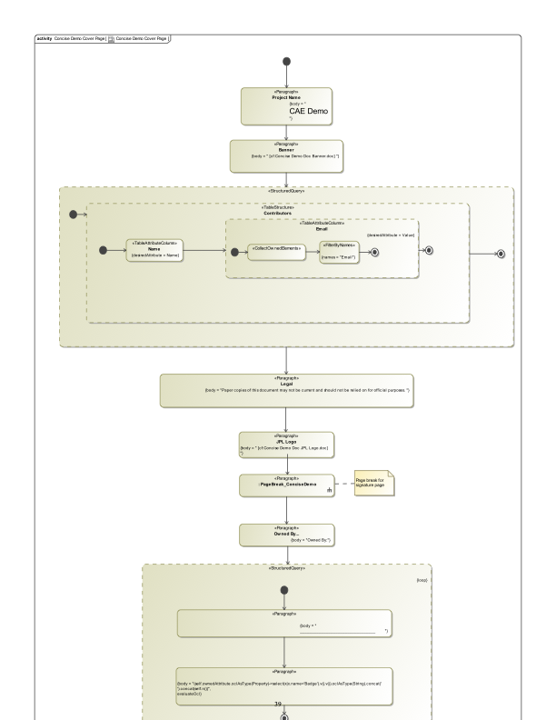

    Concise Demo Cover Page Viewpoint

The Concise Demo Cover Page is an example of a reusable cover page. It creates a cover page that includes the following:

1. A title - "CAE Demo" is displayed at the top of the page and centered, according to the Paragraph function and its internal html
2. An image - This Paragraph function includes a cross reference to a model element, whose documentation is an image.
3. A table of contributors - This Table uses the Exposed blocks (in this case, Personnel blocks) to create a table of their Name and Email attributes.
4. A "legal" paragraph - Similar to the title, this paragraph function creates and formats the written texts.
5. A logo - See #2, an image
6. A page break - this is an example of using an embedded reusable activity. In this case, there is an activity that creates a html page break and it is used here instead of creating a new one. This allows for multiple pages to be created as part of the "Cover Page"
7. A identification paragraph - "Owned by\_", see #1 and #4,
8. Signature lines with badge numbers/names of the "owners" - this structured query has several aspects:
    - It's in a separate structured query, not only for clean separation of functions, but also so that it can "loop", meaning that it will repeat the internal functions for as many times as intended. In this case, there are 2 "owners" that are exposed to the VP so it repeats twice.
    - The first paragraph is simply the html for a line and provides a place for a signature
    - The second paragraph is constructed of OCL that finds the Owner's badge number and name and concatenates them. This specific combination may not be what is most used for most formal documents, but it demonstrates how someone could use OCL to navigate through the model and get the desired attributes.
9. Commit to TW
    - Collaborate>>Commit Changes to Server
10. Generate the Cover Page
    - In the View Diagram or in the Containment Tree, Right Click Document>>MMS>>Generate View
11. See Cover Page on VE
12. To see how the Cover Page will be appear as a PDF, Generate PDF of View (note: other PDF generation options are in the provided view). Below is how the Cover Page of the Concise Demo Document appears according to the Concise Demo Cover Page above:

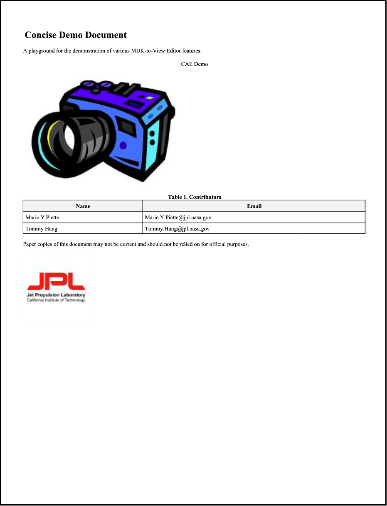

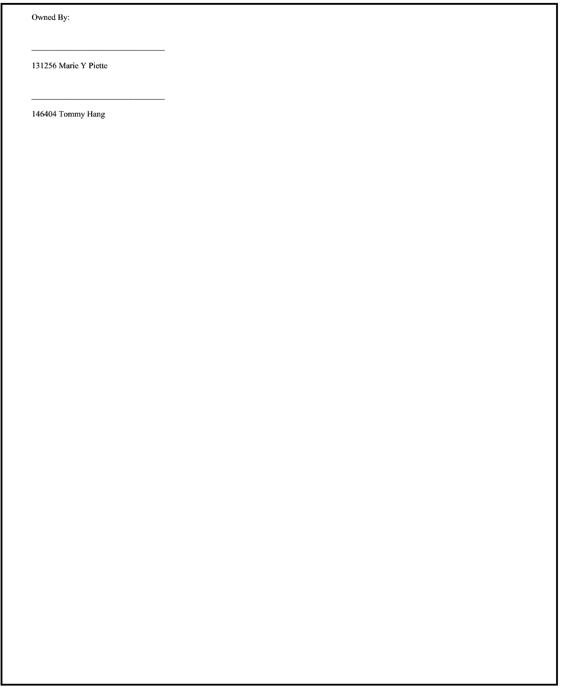
    
.. autosummary::
   :toctree: generated