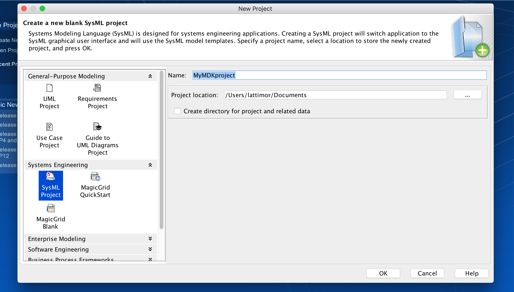
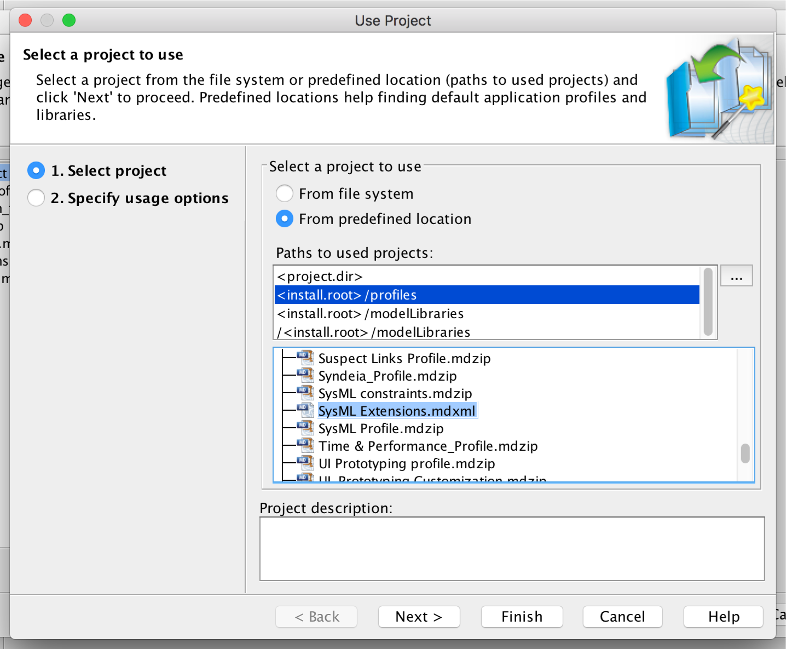
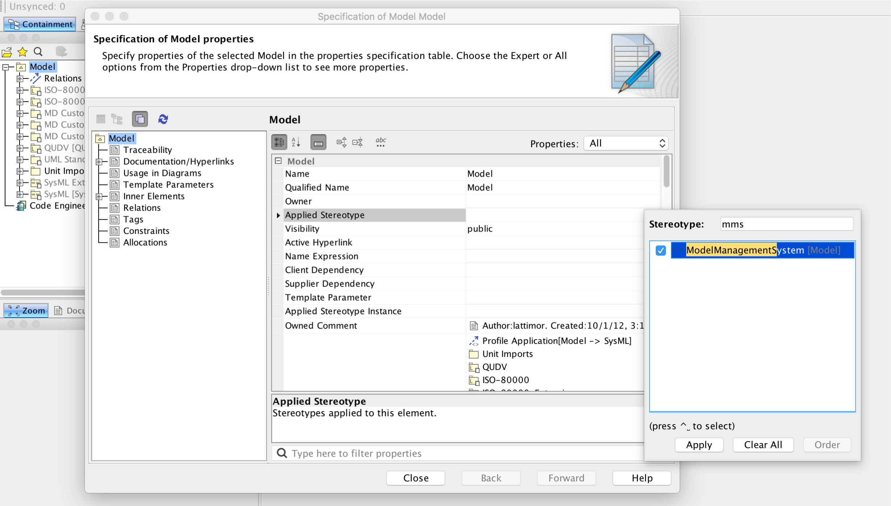

***************
Initialization
***************
The following sections are designed to guide a user through initializing and configuring a project to enable the full functionality of MDK.
Actions described below instruct the user to set up a brand new MagicDraw project that is MDK-enabled. An MDK-enabled project means that the 
entire project model will be able to sync with MMS and generate views for use in View Editor.

Create New Project
==================

First you will need to create (or open and existing) project in Cameo/Magicdraw. To open a new project in Cameo:
1. Open MagicDraw

#. File > New Project
#. Select “SysML Project” under the "Systems Engineering" section in the left side of the window
#. Name the Project
#. Choose project save location
#. Select "OK"
#. See message about System Engineering perspective

    - Perspectives switch the application to the graphical user interface designed for a specific role (such as systems engineer or analyst). Perspective options as well as details about the perspectives may be found by going to the top ribbon Options > Perspectives

    Create a new SysML project

Import MDK Module to Project
=============================

Once you have a new or existing project open you will need to mount the MDK model library (or Module) to your project.
To mount the model library:

#. Go to Options>>Project Usages
#. Select "Use Project"
#. Select "From predefined location"
#. Select "<install.root> /profiles" under paths to used projects
#. Select “SysML Extensions.mdxml” from the list of projects
#. Select "Finish"
#. See message about showing Auxiliary Resources - choose either
    - Showing Auxiliary resources allows project usages to be seen in the containment tree
#. Click "OK"

    
    Importing SysML Extensions

Add Model Management Stereotype
================================
As of version 5.1.0 there are two ways to configure your model to connect to the Model Management System 
and View Editor. First you must apply the Model Management System Stereotype:

#. Right click "Model" package > Specification
#. If greyed out, Model needs to be locked for teamwork before editing: Right click "Model" package > Lock element for edit
#. Select “Applied Stereotype” and "..." in the top right corner of the section to browse for stereotype
#. Search applied stereotypes for “MMS”
#. Select “Model Management System” stereotype
#. Select "Apply"
#.  Model specification should now have Model Management System stereotype in its specification

 Adding MMS Stereotype

Configure Model for MMS and View Editor
========================================

Configuration via JSON (New 5.1.0+)
------------------------------------

This is the new (preferred) way to configure MDK models. This not only allows you to configure your
model without the use of the stereotype tag, it also allows the configuration of the "Open in View Editor"
menu option when right-clicking on a view.

1. Click "Model" package, edit its documentation.
2. Place the following configuration options into the documentation:

.. code-block:: json

    {
      "mms": {
        "hostUrl": "protocol://hostname.com:port/"
        "basePath": "/"
      },
      "ve": {
        "hostUrl": "protocol://hostname.com:port/"
        "pasePath": "/"
      }
    }

Configuration via Stereotype Tag (pre 5.1.0)
--------------------------------------------

Actions
1. Open “Model” package specification (double click package or right click package > specification)
2. Scroll down to MMS section
3. Enter server name as MMS URL (e.g. https://mms.hostname.com)
4. Select "Close"

.. figure:: ./images/configuration-via-model-properties.png

  Specification of Model Properties

Sync Project with MMS
======================

Follow this procedure to initialize your project on the server.

Add Project to MMS
--------------------

1. Login to MMS: Select "MMS" tab from top ribbon > Login > enter username and password > ok
2. Right click “Model” > MMS > Validate Models
3. Wait for validation window to see error
4. Right Click error in Validation window > Commit Project and Model. Note: Error will remain visible until validation window is closed
5. Wait for "Choose MMS Org" dialog to pop up > Select desired Org > ok
    - New Org may be created by selecting the "New..." option from the bottom of the list and following the prompts
#. Again, Right click "Model" > MMS > Validate Models
#. Wait for validation window to see "holding bin missing in client" error
#. Right click error > update element from MMS (holding bin should now be present in the containment tree)
#. Save project locally by File > Save Project

.. autosummary::
   :toctree: generated
